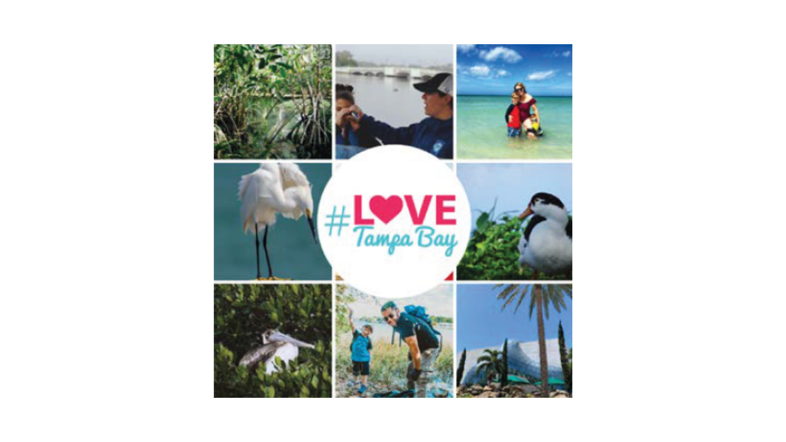
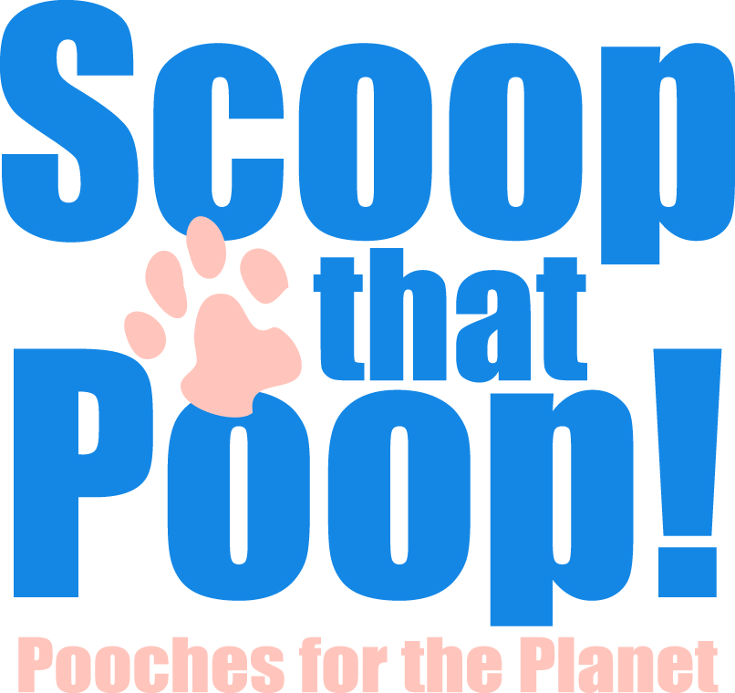

---
output:
  html_document:
    css: "styles.css"
---

```{r setup, warning = F, message = F, echo = F}
source(here::here('R/setup.R'))
```

<p><center></center></p>

[Pipe Up!](https://tbep.org/pipeup/) is TBEP’s latest community-based social marketing campaign, aimed at encouraging homeowners and home buyers to inspect, repair, or replace aging private lateral sewer lines to prevent sanitary sewer overflows into Tampa Bay and its watershed.

<p><center></center></p>

\#LoveTampaBay is a hashtag campaign supported by folks that live, work and play in Tampa Bay, with over 7k posts on Instagram. The cinematic & serene content produced by members of this digital community feeds TBEP's [Life in the Bay](https://tbep.org/lifeinthebay/) video series. 

<p><center></center></p>

TBEP keeps the [Scoop that Poop!](https://tbep.org/scoop-that-poop/) campaign alive by making outreach materials available to pet owners and interested campaign ambassadors upon request.

<p><center></center></p>

Each summer, TBEP encourages residents to "protect their fun" as part of the [Be Floridian](https://tbep.org/our-work/education/be-floridian/) campaign. Through inbound marketing tactics, the Program works to increase awareness of regional fertilizer ordinances, shares tips for individuals to reduce their nutrient footprint and encourages Florida-Friendly Landscaping practices.
