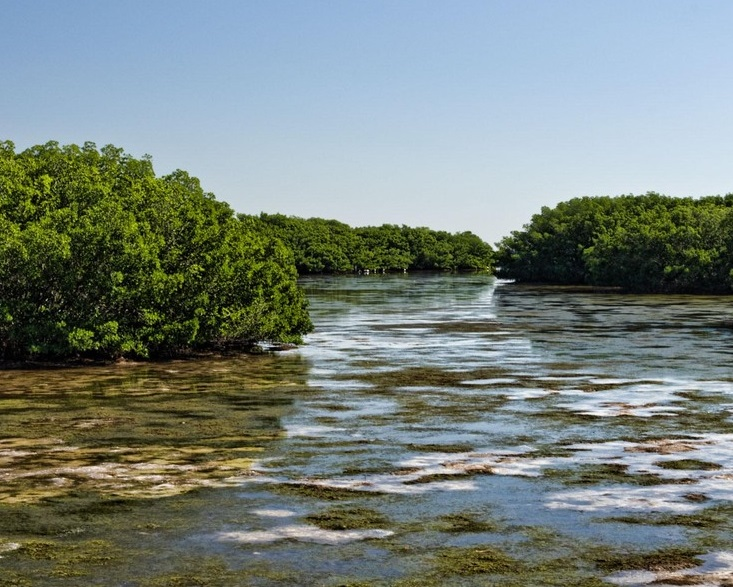

---
output:
  html_document:
    css: "styles.css"
---

```{r setup, warning = F, message = F, echo = F}
source(here::here('R/setup.R'))

load(url("https://github.com/tbep-tech/hmpu-workflow/raw/master/data/acres.RData"))
load(url("https://github.com/tbep-tech/hmpu-workflow/raw/master/data/subtacres.RData"))

submax <- '2020'
sprmax <- '2020'

subest <- lngtrmtab_fun(subtacres, 'Category', typ = 'subtidal', yrsel = '1988', topyr = submax, estout = T) %>% 
  select(val, chgper) %>% 
  tibble::deframe() %>% 
  gsub('\\-', '', .)
sprest <- lngtrmtab_fun(acres, 'Category', typ = 'supratidal', yrsel = '1990', topyr = sprmax, estout = T) %>% 
  select(val, chgper) %>% 
  tibble::deframe() %>% 
  gsub('\\-', '', .)
```

Prior to the 1980s, many of Tampa Bay’s habitats were damaged, reduced, or lost during development activities. Once the value of these habitats was recognized, protections were put in place and monitoring began on a regular basis to understand the effectiveness of different conservation and restoration activities.

<center></center>
<p></p>

## Current Trends

When viewed as a whole, the most significant and meaningful trends in the TBEP habitats of interest over the periods of record examined include: 1) the `r subest['Seagrasses']`% gain in seagrasses from 1988 to `r submax`; 2) the gains in both emergent tidal wetlands (`r sprest['Mangrove Forests']`% gain in mangroves, `r sprest['Salt Marshes']`% gain in salt marshes) and freshwater wetlands (`r sprest['Non-Forested Freshwater Wetlands']`% gain) between 1990 and `r sprmax`; and 3) the `r sprest['Native Uplands']`% loss in native upland habitats from 1990 to `r sprmax`. 

The increasing trend in seagrass coverage is a testament to improved bay water quality. While some recent gains in seagrass coverage have been erased, the remaining seagrasses still reflect improvements in water quality over the past several decades and still serve as an important guidepost for successful restoration of those subtidal habitats. Seagrass losses in Old Tampa Bay accompanied by increases in attached algae are being studied to understand the importance of these changes.

```{r}
lngtrmtab_fun(subtacres, 'Category', typ = 'subtidal', yrsel = '1988', topyr = submax, estout = F, family = fml)
```

The intertidal habitat gains demonstrate the effectiveness of publicly-funded habitat restoration projects (see Habitat Restoration tab) and state and federal wetland regulatory programs. Increases in salt barrens may also reflect a landward expansion associated with sea level rise. However, a `r sprest['Developed']`% increase for developed lands and `r sprest['Restorable']`% loss for restorable lands in the watershed is a concern for continued habitat restoration and protection. A loss of upland habitats is the result of continued human population growth and urban development in the Tampa Bay watershed, and unless local protections for native upland habitats improve, this trend will likely continue.

```{r}
lngtrmtab_fun(acres, 'Category', typ = 'supratidal', yrsel = '1990', topyr = sprmax, estout = F, family = fml)
```

See additional visualization tools for land use change here: https://shiny.tbep.org/landuse-change/. See additional visualization tools for seagrass coverage data here: https://shiny.tbep.org/seagrass-analysis/. See additional visualization tools for seagrass species change here: https://shiny.tbep.org/seagrasstransect-dash/. 

<script type="text/javascript" src="js/iframeResizer.contentWindow.min.js"></script>
