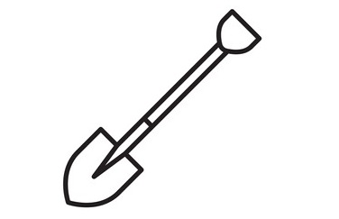

---
output:
  html_document:
    css: "styles.css"
    self_contained: false
---

```{r setup, warning = F, message = F, echo = F}
source(here::here('R/setup.R'))
load(file = here('data/tberfdat.RData'))
load(file = here('data/bmgdat.RData'))
load(file = here('data/dcgdat.RData'))
load(file = here('data/comdat.RData'))
maxyr <- 2023
tberfsum <- grntsum_fun(tberfdat)
bmgsum <- grntsum_fun(bmgdat)
dcgsum <- grntsum_fun(dcgdat, rnd = 'k')
```

<p></p>
<div id="wrapper">
<figure>


</figure>
</div>
<p></p>

To date, the Tampa Bay Environmental Restoration Fund ([TBERF](https://tbep.org/our-work/restoration-research/tberf/){target="_parent"}) has received `r tberfsum['total']` in funding and `r tberfsum['matching']` in matching funds to support `r tberfsum['n']` grants within the Tampa Bay watershed.

<div id="wrapper">
<figure>


</figure>
</div>
<p></p>

Funded by sales from of the Tampa Bay Estuary Specialty License Plate, also known as the [Tarpon Tag](https://tbep.org/get-involved/tarpon-tag/){target="_parent"}, [Bay Mini-Grants](https://tbep.org/our-work/restoration-research/bay-mini-grants/){target="_parent"} provide competitive cash awards (up to \$5,000) to community organizations for projects that help restore and protect Tampa Bay. To achieve Program CCMP goals, specific Bay Mini-Grant priority actions are announced annually. Expanding the use of green infrastructure and understanding emerging contaminants have both been recent Bay Mini-Grant priorities. Since 2000, sales from the Tarpon Tag specialty license plate have collectively awarded `r bmgsum['total']` to `r bmgsum['n']` community-based restoration projects in the bay through TBEP's Bay Mini-Grant program.

<center></center>

Established during the COVID-19 pandemic, the [Digital Challenge Grants](https://tbep.org/our-work/restoration-research/digital-challenge-grants/){target="_parent"} program was created to provide safer-at-home income opportunities for digital content creators, science communicators, graphic designers, and educators. In its first year, `r dcgsum['n']` creators were awarded `r dcgsum['total']` in project funding.

### `r maxyr` FUNDING SUMMARY 

```{r}
grnt_tab(tberfdat, bmgdat, dcgdat, yrsel = maxyr, family = fml)
```

### `r maxyr` LICENSE PLATE SALES

```{r}
coms_tab(comdat, category = 'Tarpon Tag', maxyr = maxyr, chg = F, family = fml, showtab = F)
```

## TOTALS TO DATE {.tabset .tabset-pills}

The following shows totals to date for each of the grant programs coordinated by TBEP and our partners.  Click on each tab to view the summary plot.

### Tampa Bay Environmental Restoration Fund

```{r, out.width = '100%'}
grntsum_plo(tberfdat, family = fml, width = 1000, height = 400)
```

### Bay Mini Grants

```{r, out.width = '100%'}
grntsum_plo(bmgdat, family = fml, width = 1000, height = 400)
```

### License Plate Sales

```{r, out.width = '100%'}
grntsum_plo(comdat, family = fml, width = 1000, height = 400)
```

<script type="text/javascript" src="js/iframeResizer.contentWindow.min.js"></script>