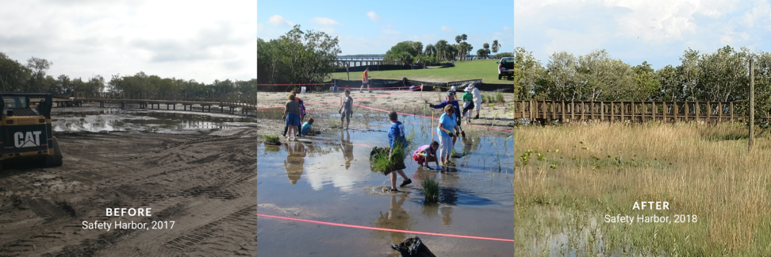

---
output:
  html_document:
    css: "styles.css"
---

```{r setup, warning = F, message = F, echo = F}
source(here::here('R/setup.R'))

maxyr <- 2022
# https://docs.google.com/spreadsheets/d/1IkGidfU4SQJ_ZtOEqfn8licNCuWGlq_MtGuWWuIL1Js/edit#gid=2008440809
rstdat <- read_sheet('1IkGidfU4SQJ_ZtOEqfn8licNCuWGlq_MtGuWWuIL1Js', sheet = 'FullDatabase')
```

Habitat restoration attempts to restore important services provided by natural systems. These ecological services can include providing fish nurseries; improving water quality; reducing erosion; and protection against storm surge. Habitat restoration is done for a variety of habitat types, from salt marshes to pine flatwoods. 

<p>
<center>
<figure>

<figcaption>Habitat restoration at Safety Harbor</figcaption>
</figure>
</center>
<p>

Habitat restoration in the Tampa Bay region has evolved over time from simple projects including planting of red mangroves west of the Howard Frankland bridge in 1971 to major landscape-scale ecosystem restoration projects such as Rock Ponds, that involved 1,043 acres of landform changes on critical coastal land. Nearly 5,000 acres of habitat restoration has occurred in the Tampa Bay watershed since 1971. Tampa Bay restoration professionals work to create or restore a mosaic of habitats to reflect the variety seen in natural systems.

```{r}
rstdat_tab(rstdat, maxyr = maxyr, family = fml)
```

To continue the improvements that have occurred, the Habitat Master Plan ([2020 Update](https://drive.google.com/file/d/1Hp0l_qtbxp1JxKJoGatdyuANSzQrpL0I/view)) includes a target of restoring 3,150 acres of wetlands and uplands by 2030:

* 50 acres of oyster reefs

* 1,000 acres of tidal wetlands, such as salt marshes, salt barrens, and mangroves

* 1,500 acres of freshwater wetlands, including freshwater marshes, wet prairies, and cypress forests

* 600 acres of uplands, including coastal hammocks and pine flatwoods

## Resources

* [2020 Tampa Bay Habitat Master Plan Update](https://drive.google.com/file/d/1Hp0l_qtbxp1JxKJoGatdyuANSzQrpL0I/view)

* [Restoration opportunities by segment](https://github.com/tbep-tech/hmpu-workflow)

* [Habitat restoration table](https://drive.google.com/file/d/1zVx18P6lrPuVR6ANMAetBRXwxCGeCN9b/view?usp=sharing)

* [Habitat restoration projects (and associated database) in the Tampa Bay Watershed](https://www.tampabay.wateratlas.usf.edu/restoration/)

<script type="text/javascript" src="js/iframeResizer.contentWindow.min.js"></script>
