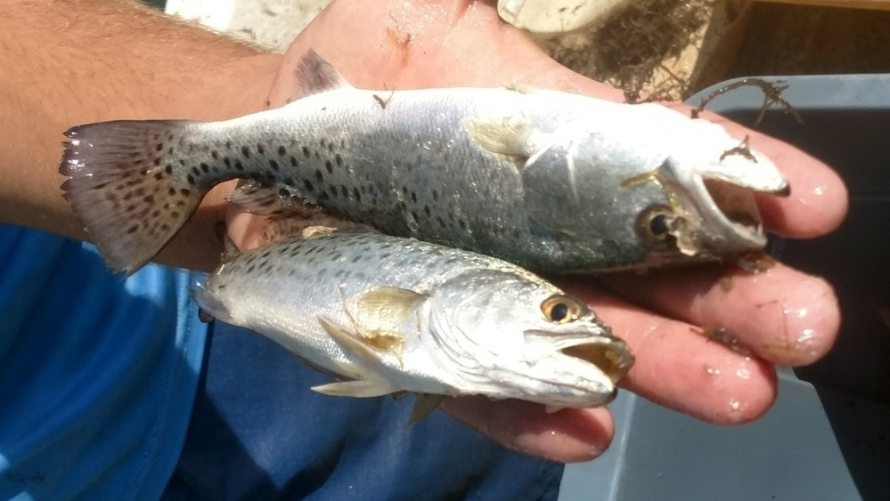
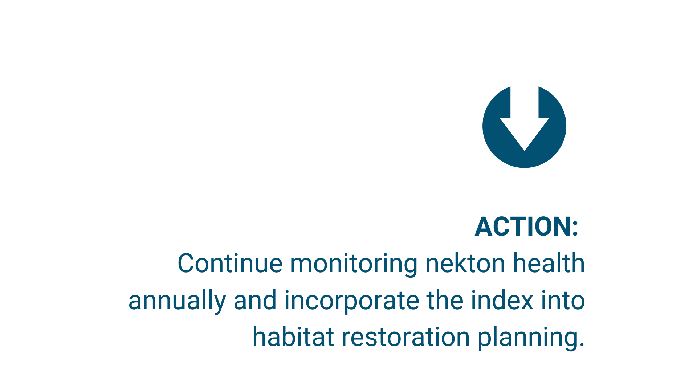

---
output:
  html_document:
    css: "styles.css"
    self_contained: false
---

```{r setup, warning = F, message = F, echo = F}
source(here::here('R/setup.R'))

maxyr <- 2022
tbniscr <- anlz_tbniscr(fimdata)

# summaries for inline
sums <- tbnisum_fun(tbniscr, maxyr)
```

The Tampa Bay Nekton Index (TBNI), which is similar to the water quality scorecard, uses data from the State of Florida’s Fisheries Independent Monitoring Program (FWC - FWRI) to track trends for representative fish and invertebrate species. With samples dating back to 1998, the long-term record can be related to water quality and habitat characteristics to identify factors affecting health of bay fisheries. The index evaluates catch data relative to habitat use, species composition and diversity, and feeding dynamics to understand trends in the fish community.

<center></center>
<p></p>

An annual "snapshot" of ecological health helps fisheries managers target efforts to improve habitat or other factors. Nekton index scores can be translated into actionable management categories with narrative interpretations. Each action category has a description to provide guidance to managers:

<span style="color:#2DC938; letter-spacing: 2px">__Stay the Course__</span>: Continue planned projects. Report data via annual progress reports. 

<span style="color:#E9C318; letter-spacing: 2px">__Caution__</span>: Review monitoring data and identify additional research/monitoring needs. Begin/continue TAC and Management Board development of specific management recommendations.

<span style="color:#CC3231; letter-spacing: 2px">__On Alert__</span>: Finalize development and implement appropriate management actions to get nekton community back on track.
  
The long-term results for the nekton index suggest the fish community is resistant to large-scale changes and resilient to episodic disturbance. For example, "Yellow" cautionary scores were observed in the mid-2000s and 2010/11 when red tide conditions and cold snaps may have affected the bay fish community. Recent conditions in 2021 and 2022 suggest the fish community was likely affected by the summer red tide observed in Tampa Bay.  Long-term trends in nekton index scores by bay segment are shown below.

```{r, out.width = '100%'}
p <- show_tbniscr(tbniscr, family = fml, width = 950, height = 450, plotly = T)
div(p, align = 'center')
```

## Results for `r maxyr`

In `r maxyr`, Old Tampa Bay received an action category of `r sums$OTB$action` (nekton index score of `r sums$OTB$scr`), Hillsborough Bay received an action category of `r sums$HB$action` (nekton index score of `r sums$HB$scr`), Middle Tampa Bay received an action category of `r sums$MTB$action` (nekton index score of `r sums$MTB$scr`), and Lower Tampa Bay received an action category of `r sums$LTB$action` (nekton index score of `r sums$LTB$scr`)

```{r}
p <- show_tbnimatrix(tbniscr, width = 350, height = 600, plotly = T, family = fml)
div(p, align = 'center')
```

<center></center>

See additional visualization tools for the nekton index on our data page: https://tbep.org/tampa-bay-nekton-index/.

<script type="text/javascript" src="js/iframeResizer.contentWindow.min.js"></script>
