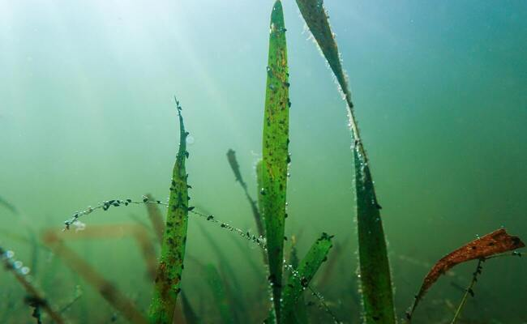
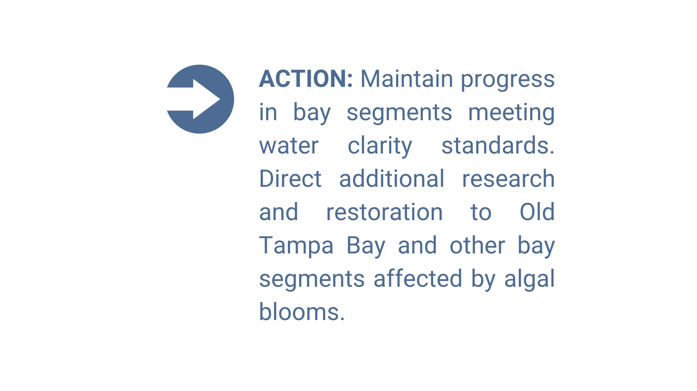

---
output:
  html_document:
    css: "styles.css"
    self_contained: false
---

```{r setup, warning = F, message = F, echo = F}
source(here::here('R/setup.R'))
maxyr <- 2023

# local file path
xlsx <- here('data-raw/Results_Updated.xls')
# xlsx <- here('data-raw/Results_Provisional.xlsx')

# import and download if new
# epcdata <- read_importwq(xlsx, download_latest = T)
epcdata <- read_importwq(xlsx, download_latest = T)

# summaries for inline
sums <- wqsum_fun(epcdata, maxyr)
```

Water quality in Tampa Bay has improved steadily in recent decades due to pollution reduction projects and restoration of bay habitats. Tampa Bay has generally met water quality standards in each bay segment, excluding Old Tampa Bay, since 2006.

<div id="wrapper">
<figure>


</figure>
</div>
<p></p>

The water quality report card is produced annually to track status and trends of water quality conditions in each of the four major bay segments.  This tool provides a simple "stoplight" graphic using water quality data provided by the Environmental Protection Commission of Hillsborough County.  The report card synthesizes thousands of water quality records to understand annual and seasonal variation in chlorophyll concentrations and water column light attenuation.  Chlorophyll provides a measure of algae growth in the water column and light attenuation provides a measure of potential shading from algae growth that can limit seagrass growth.  Excess nutrient pollution from atmospheric, wastewater, and stormwater sources can cause excess algae growth. The goal of the report card is to assess water quality trends that may be harmful for bay habitats, including conditions that are unfavorable for seagrass growth, to inform management activities that support a healthy environment.   

Tracking the attainment of bay segment specific targets for chlorophyll and light attenuation provides the framework for developing and initiating bay management actions. TBEP management actions adopted in response to the annually-assessed decision support results are shown below.

<span style="color:#2DC938; letter-spacing: 2px">__Stay the Course__</span>: Continue planned projects. Report data via annual progress reports and Baywide Environmental Monitoring Report. 

<span style="color:#E9C318; letter-spacing: 2px">__Caution__</span>: Review monitoring data and nitrogen loading estimates. Begin/continue TAC and Management Board development of specific management recommendations.

<span style="color:#CC3231; letter-spacing: 2px">__On Alert__</span>: Finalize development and implement appropriate management actions to get back on track.

The management category or action is based on the combination of annual outcomes for chlorophyll and light attenuation.   

```{r}
p <- show_matrix(epcdata, yrrng = c(1975, maxyr), txtsz = 3, abbrev = T, historic = T, family = fml, plotly = T, width = 300, height = 700) 
div(p, align = 'center')
```

<center></center>

## Results for `r maxyr`

In `r maxyr`, Old Tampa Bay received an action category of `r sums$OTB$action` (chlorophyll target `r sums$OTB$chla`, light attenuation target `r sums$OTB$la`), Hillsborough Bay received an action category of `r sums$HB$action` (chlorophyll target `r sums$HB$chla`, light attenuation target `r sums$HB$la`), Middle Tampa Bay received an action category of `r sums$MTB$action` (chlorophyll target `r sums$MTB$chla`, light attenuation target `r sums$MTB$la`), and Lower Tampa Bay received an action category of `r sums$LTB$action` (chlorophyll target `r sums$LTB$chla`, light attenuation target `r sums$LTB$la`). The plots below show chlorophyll and light attenuation values for each bay segment, including the management target.

See additional visualization tools at the Water Quality Report Card data page: [https://tbep.org/water-quality-report-card/](https://tbep.org/water-quality-report-card){target="_parent"}. Click on the tabs below to view water quality trends for each major bay segment.

# {.tabset .tabset-pills}

## Old Tampa Bay

```{r, out.width = '100%'}
wqplotly_plo(epcdata, bay_segment = 'OTB', yrrng = c(1975, maxyr), family = fml, width = 1000, height = 500)
```

## Hillsborough Bay

```{r, out.width = '100%'}
wqplotly_plo(epcdata, bay_segment = 'HB', yrrng = c(1975, maxyr), family = fml, width = 1000, height = 500)
```

## Middle Tampa Bay

```{r, out.width = '100%'}
wqplotly_plo(epcdata, bay_segment = 'MTB', yrrng = c(1975, maxyr), family = fml, width = 1000, height = 500)
```

## Lower Tampa Bay

```{r, out.width = '100%'}
wqplotly_plo(epcdata, bay_segment = 'LTB', yrrng = c(1975, maxyr), family = fml, width = 1000, height = 500)
```

<script type="text/javascript" src="js/iframeResizer.contentWindow.min.js"></script>
